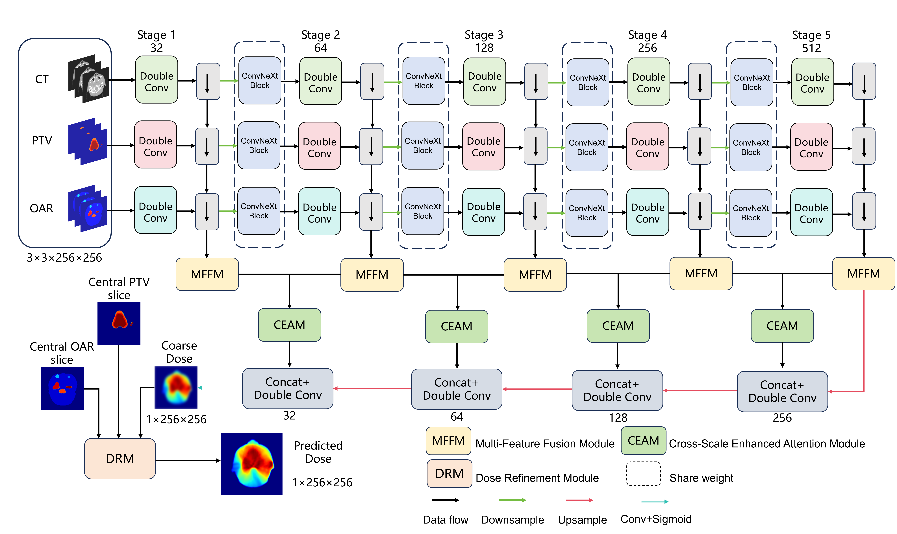

[](https://www.python.org/)


# MMF-Net

This repository contains a PyTorch implementation of **MMF-Net**, a 2.5D multi-branch network for radiotherapy dose prediction. The network predicts the dose distribution of the central slice from neighboring computed tomography (CT) slices, planning target volume (PTV) masks, and organ-at-risk (OAR) masks.

For every prediction target, the default input contains three neighboring slices from each modality:

```text
Input:  [batch, 3 modalities, 3 slices, 256, 256]
Output: [batch, 1 dose channel, 256, 256]
```

The three modality branches extract features independently and share ConvNeXt blocks at corresponding stages. Multi-scale features are combined by the Multi-Feature Fusion Module (MMFM), enhanced by the Cross-Scale Enhanced Attention Module (CEAM), decoded to a coarse dose map, and refined by the Dose Refinement Module (DRM).



## Network components

- **2.5D input:** adjacent CT, PTV, and OAR slices provide limited through-plane context while the network predicts only the central dose slice.
- **Multi-branch encoder:** CT, PTV, and OAR information is processed by three modality-specific branches.
- **Shared ConvNeXt blocks:** corresponding encoder stages share feature-transformation weights across the three branches.
- **MMFM:** fuses CT, PTV, and OAR features at multiple encoder scales.
- **CEAM:** enhances decoder features using cross-scale contextual information.
- **DRM:** refines the coarse dose map with the central PTV and OAR slices.

## Project structure

```text
2.5D Muti-branch/
├── model/
│   ├── MMF_net.py             # MMF-Net architecture
│   └── MMF-Net.png            # Network architecture figure
├── dataset_domain.py          # 2.5D training and validation dataset
├── dataset_domain_test.py     # Patient-level test dataset
├── loss.py                    # MS-SSIM, MAE, and ranking losses
├── trainer.py                 # Training and validation loops
├── train.py                   # Training entry point
├── test25d.py                 # Patient-level 2.5D inference
└── README.md
```

## Data organization

The dataset root should contain `train_set`, `val_set`, and `test_set`. Each patient directory must contain four NIfTI volumes with matching shapes and spatial alignment:

```text
data/
├── train_set/
│   └── patient_001/
│       ├── ct.nii.gz
│       ├── oars.nii.gz
│       ├── ptvs.nii.gz
│       └── dose.nii.gz
├── val_set/
│   └── patient_002/
│       ├── ct.nii.gz
│       ├── oars.nii.gz
│       ├── ptvs.nii.gz
│       └── dose.nii.gz
└── test_set/
    └── patient_003/
        ├── ct.nii.gz
        ├── oars.nii.gz
        ├── ptvs.nii.gz
        └── dose.nii.gz
```

SimpleITK loads each volume as `[Z, H, W]`. During training, blank slices are added to both ends of the Z axis. A sample is then constructed as `[3, 3, H, W]`: three modalities, each containing the previous, central, and next slices. The supervision target is the central dose slice `[1, H, W]`.

During testing, one patient volume is loaded at a time. The test script constructs a 2.5D window for every center position, predicts all slices in their original order, and reconstructs the output dose volume.

## Requirements

- Python 3.8 or later
- PyTorch
- NumPy
- SimpleITK
- TensorBoard
- timm
- fvcore (optional; only required for FLOPs calculation when running `model/MMF_net.py` directly)

Example installation:

```bash
pip install torch numpy SimpleITK tensorboard timm fvcore
```

Install a PyTorch build compatible with the CUDA version on the target machine.

## Training parameters

- `epochs`: maximum number of training epochs. Default: `300`.
- `step-size`: StepLR decay interval. Default: `40`.
- `batch-size`: training batch size. Default: `12`.
- `gamma`: StepLR decay factor. Default: `0.4`.
- `resume`: checkpoint path used to resume training. Default: disabled.
- `learning-rate`: initial learning rate. Default: `3e-4`.
- `data-dir`: dataset root containing `train_set` and `val_set`. Default: `./data/`.
- `checkpoint-path`: model checkpoint directory. Default: `./checkpoint/`.
- `log-path`: TensorBoard log directory. Default: `./log/`.
- `model`: model name. Use `MMF_net`.
- `unique_name`: experiment name. Default: `exp1`.
- `weight_decay`: Adam weight decay. Default: `1e-4`.
- `gpu`: visible GPU identifier. Default: `0`.

## Start training

Run training from the project root:

```bash
python train.py \
  --model MMF_net \
  --data-dir ./data/ \
  --checkpoint-path ./checkpoint/ \
  --log-path ./log/ \
  --unique_name exp1 \
  --gpu 0
```

The training code uses Adam and StepLR. Its objective combines MS-SSIM, mean absolute error, and ranking loss:

```text
Loss = 0.3 × MS-SSIM loss + 0.4 × MAE + 0.3 × rank loss
```

Checkpoints are written to:

```text
checkpoint/exp1/
├── epoch0.pth
├── epoch20.pth
└── best.pth
```

TensorBoard logs are written to `log/exp1/` and can be viewed with:

```bash
tensorboard --logdir ./log
```

## Test parameters

- `checkpoint-path`: checkpoint and result root. Default: `./checkpoint2/`.
- `unique-name`: experiment directory. Default: `test`.
- `training-parameter`: checkpoint filename. Default: `best.pth`.
- `test-dir`: dataset root containing `test_set`. Default: `./data/`.
- `gpu`: visible GPU identifier. Default: `0`.
- `slice-gap`: distance between neighboring slices. Default: `1`.
- `inference-batch-size`: number of 2.5D windows inferred together. Default: `4`.

## Test

Place the trained checkpoint at the configured location and run:

```bash
python test25d.py \
  --checkpoint-path ./checkpoint2/ \
  --unique-name test \
  --training-parameter best.pth \
  --test-dir ./data/ \
  --slice-gap 1 \
  --inference-batch-size 4 \
  --gpu 0
```

The default checkpoint path is:

```text
checkpoint2/test/best.pth
```

Test outputs are organized by patient:

```text
checkpoint2/test/
├── label/
│   └── patient_003/
│       ├── ct.nii.gz
│       ├── oars.nii.gz
│       ├── ptvs.nii.gz
│       └── dose.nii.gz
└── pred/
    └── patient_003/
        └── dose.nii.gz
```

The script reports the mean absolute error and inference time for each patient.

## Notes

- `MMF_net` currently expects exactly three neighboring slices for each modality.
- Training and testing must use the same dose normalization and slice ordering.
- CT, PTV, OAR, and dose volumes belonging to one patient must have identical dimensions and alignment.
- Medical data and large model checkpoints should normally be excluded from Git or managed using Git LFS.
